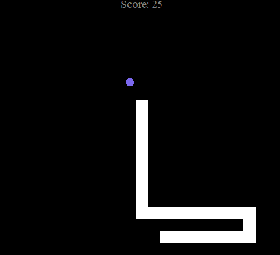

# 🐍 Snake Game (Python Turtle)

**Snake Game** built in Python using the `turtle` graphics library.  
The game features a moving snake, randomly appearing food, score tracking, and screen wrap-around movement.

---

## 🎮 How to Play
- Use the **Arrow Keys** to control the snake:
  - ⬆️ Up  
  - ⬇️ Down  
  - ⬅️ Left  
  - ➡️ Right  
- Eat the purple food to score points.  
- Each time the snake eats, it grows longer.  
- The game wraps around the edges: if you move off one side of the screen, the snake reappears on the opposite side.  

---

## 🖥️ Preview
  

---

## 📂 Project Structure
    snake-game/
    │── main.py # Game entry point
    │── snake.py # Snake class (movement, growth, controls)
    │── food.py # Food class (random appearing)
    │── scores.py # Scoreboard class

---

## 🚀 Getting Started

### Prerequisites
- Python **3.x**
- No extra dependencies (uses only the built-in `turtle` and `time` libraries).

### Installation
Clone this repository:
```bash
git clone https://github.com/folaarr/snake-game.git
cd snake-game
```

### Run the game
```bash
python main.py
```

---

## ⭐ Features
- Smooth snake movement
- Screen wrap-around gameplay
- Randomized food placement
- Scoreboard that updates in real-time
